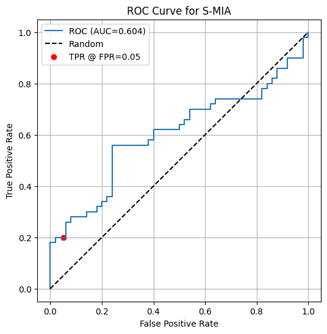
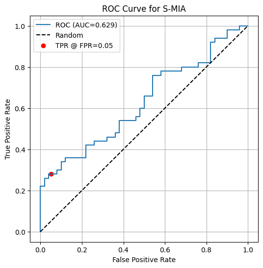
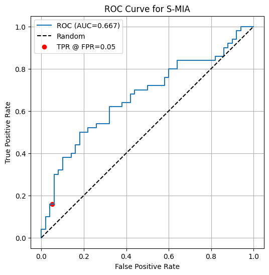
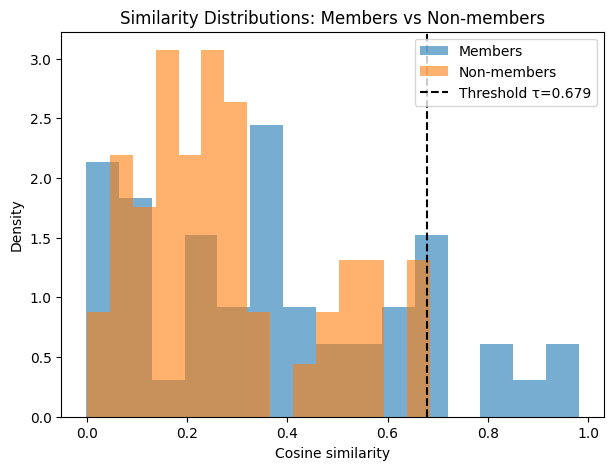
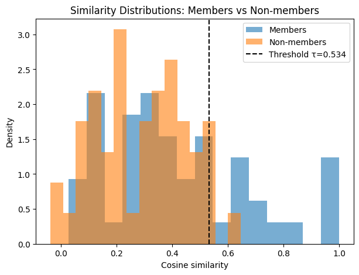
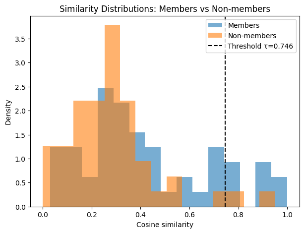

# Similarity-Based-Membership-Inference-Attacks-Against-RAG-Systems
This repository provides a **complete, reproducible implementation** of a **Similarity-Based Membership Inference Attack (S-MIA)** against a **Retrieval-Augmented Generation (RAG)** system.  
It demonstrates that even a **small LLM on CPU** leaks **non-trivial membership information**, confirming the privacy vulnerabilities described in the *RAG-Leaks* attack paper.

---
### Retrieval-Augmented Generation (RAG)
A RAG system retrieves the top-k most relevant documents using MiniLM embeddings and feeds them as context to an LLM (Flan-T5-small).

### Membership Inference Attack (S-MIA)
An attacker:
1. Queries the RAG with the document's prefix.
2. Collects the generated answer.
3. Computes cosine similarity between the generated answer and the ground-truth answer.
4. Predicts "member" if similarity > threshold τ.

---

## Experimental Setup

### **Models Used**
| Component | Model |
|----------|--------|
| Retriever | `sentence-transformers/all-MiniLM-L6-v2` |
| LLM | `google/flan-t5-small` |
| Index | FAISS (Inner Product for Cosine Similarity) |

### **Dataset**
- AgNews (first **3000** samples)
- Split each sample:
  - query = first half  
  - answer = second half  

### **Knowledge Base (KB)**
- 300 samples stored in the retriever index

### **Evaluation**
- 50 **member** samples (in KB)
- 50 **non-member** samples (outside KB)
- Attack threshold constrained at **FPR = 5%**

---

## Experimental Results

Across three seeds (42, 43, 44):

| Seed | AUC | TPR @ 5% FPR |
|------|------|--------------|
| 42   | 0.604 | 20% |
| 43   | 0.629 | 28% |
| 44   | 0.667 | 16% |
| **Mean** | **0.633** | **21.33%** |
| **Std** | 0.026 | 4.99% |

### Interpretation
- AUC > 0.5 confirms **membership leakage exists**.
- Even a small RAG running entirely on CPU leaks **meaningful membership signals**.
- Overlap between distributions explains why S-MIA is limited → DC-MIA would be stronger.

---

## Visualizations

### **ROC Curves**

| Seed 42 | Seed 43 | Seed 44 |
|---------|---------|----------|
|  |  |  |

### **Similarity Distributions**

| Seed 42 | Seed 43 | Seed 44 |
|---------|---------|----------|
|  |  |  |

These plots illustrate:
- Degree of overlap in similarity scores
- Threshold τ placement
- True Positive Rate at FPR = 0.05

---

## How to Run

### 1. Install Dependencies
```bash
pip install -r requirements.txt
```
### 2. Run the Attack
```bash
python main.py

```

---

## Full Research Report

A complete academic-style, two-column IEEE-format report is available here:

[**A Lightweight Empirical Analysis of Similarity-Based Membership Inference Attacks Against Retrieval-Augmented Generation Systems (PDF)**](A_Lightweight_Empirical_Analysis_of_Similarity_Based_Membership_Inference_Attacks_Against_Retrieval_Augmented_Generation_Systems.pdf)

You can download or view the PDF directly from the repository.

